# Flipkart Laptop Scraper: Technical Architecture and Complete Execution Flow

This document explains the complete runtime behavior of the Flipkart laptop
ETL. It covers the command-line entry point, network requests, retry policy,
cache lifecycle, search discovery, product-detail concurrency, structured data
extraction, transformation of all 19 fields, validation, Excel generation,
failure paths, testing, performance, and the boundary between GitHub hosting and
actual scraper execution.

ETL means **Extract, Transform, Load**:

- **Extract:** download search and product-detail HTML from Flipkart.
- **Transform:** turn nested and sometimes messy source data into 19 clean fields.
- **Load:** validate those fields and write a formatted Excel workbook.

## 1. Diagram artifacts

Every diagram has four useful representations:

| Format | Purpose |
|---|---|
| `.excalidraw` | Editable source. Open at [excalidraw.com](https://excalidraw.com) with **File > Open**. |
| `.mmd` | Mermaid source. Easy to review and change as text. |
| `.svg` | Crisp vector image for GitHub, browsers, and documents. |
| `.png` | Raster preview for sharing and quick viewing. |

| Diagram | Editable | Mermaid | Vector | Preview |
|---|---|---|---|---|
| Complete ETL | [Excalidraw](../diagrams/flipkart-etl-complete-flow.excalidraw) | [Source](../diagrams/flipkart-etl-complete-flow.mmd) | [SVG](../diagrams/flipkart-etl-complete-flow.svg) | [PNG](../diagrams/flipkart-etl-complete-flow.png) |
| Search, HTTP, cache | [Excalidraw](../diagrams/search-network-cache-flow.excalidraw) | [Source](../diagrams/search-network-cache-flow.mmd) | [SVG](../diagrams/search-network-cache-flow.svg) | [PNG](../diagrams/search-network-cache-flow.png) |
| Product transformation | [Excalidraw](../diagrams/product-transformation-flow.excalidraw) | [Source](../diagrams/product-transformation-flow.mmd) | [SVG](../diagrams/product-transformation-flow.svg) | [PNG](../diagrams/product-transformation-flow.png) |
| Validation and Excel | [Excalidraw](../diagrams/validation-excel-flow.excalidraw) | [Source](../diagrams/validation-excel-flow.mmd) | [SVG](../diagrams/validation-excel-flow.svg) | [PNG](../diagrams/validation-excel-flow.png) |

## 2. Complete end-to-end architecture



The runtime has four phases:

1. Discover unique product URLs from sequential search pages.
2. Download uncached product-detail pages with a bounded worker pool.
3. Extract structured data and normalize the required 19 fields.
4. Validate the row contract and write the Excel workbook.

## 3. System boundaries

```text
User terminal
    |
    | python3 flipkart_laptop_scraper_exact.py
    v
Local Python process
    |-- command-line configuration
    |-- HTTP sessions and retry policy
    |-- HTML and JSON extraction
    |-- transformation rules
    |-- cache file
    `-- Excel writer
         |
         +---- HTTPS GET ----> Flipkart search/product pages
         |
         +---- JSON ----------> .flipkart_laptop_cache.json
         |
         `---- XLSX ----------> output/flipkart_laptops.xlsx
```

The public GitHub repository stores the source and documentation. GitHub does
not currently run the scraper on a schedule. A local machine, server, cron job,
or GitHub Actions workflow must invoke the Python command.

## 4. Repository structure

```text
flipkart-laptop-scraper/
|-- flipkart_laptop_scraper_exact.py       # executable entry point
|-- flipkart_scraper/
|   |-- __init__.py                        # package declaration
|   |-- cache.py                           # JSON cache
|   `-- core.py                            # complete ETL implementation
|-- test_flipkart_laptop_scraper_exact.py  # 18 regression tests
|-- requirements.txt                       # runtime dependencies
|-- README.md                              # setup and common commands
|-- docs/
|   |-- FLIPKART_LAPTOP_SCRAPER_FIX_GUIDE.md
|   `-- TECHNICAL_ARCHITECTURE_AND_EXECUTION_FLOW.md
|-- diagrams/
|   |-- *.mmd                              # Mermaid sources
|   |-- *.excalidraw                       # editable diagrams
|   |-- *.svg                              # vector renders
|   `-- *.png                              # raster renders
|-- output/                                # generated data, ignored by Git
|-- .flipkart_laptop_cache.json            # runtime cache, ignored by Git
`-- .gitignore
```

## 5. Installation tutorial

### Prerequisites

- Python 3.11 or newer.
- Internet access to Flipkart.
- Permission to write into the project directory.

### Step 1: create an isolated environment

```bash
python3 -m venv .venv
source .venv/bin/activate
```

The virtual environment prevents the scraper packages from changing other
Python projects on the machine.

### Step 2: install dependencies

```bash
python3 -m pip install -r requirements.txt
```

| Dependency | Runtime responsibility |
|---|---|
| `requests` | HTTP sessions, timeouts, headers, and status errors |
| `beautifulsoup4` | HTML and `<script>` parsing |
| `pandas` | Tabular row construction and duplicate removal |
| `openpyxl` | XLSX output and cell formatting |

### Step 3: produce a small visible result

```bash
python3 flipkart_laptop_scraper_exact.py --pages 2
```

Expected final message:

```text
Wrote <row-count> parsed rows to <project>/output/flipkart_laptops.xlsx
```

## 6. Entry point and call stack

The executable is `flipkart_laptop_scraper_exact.py`. It deliberately contains
almost no business logic. It imports the public parser functions for backward
compatibility and invokes `core.main()` only when executed as a script.

```text
Python interpreter
  `-- flipkart_laptop_scraper_exact.py::__main__
      `-- core.main()
          |-- parse_args()
          |-- RowCache(...)
          |-- discover_products(...)
          |   |-- RowCache.get(search key)
          |   |-- fetch(search URL)
          |   `-- parse_search_page(html)
          |-- scrape_products(...)
          |   |-- RowCache.get(product URL)
          |   |-- ThreadPoolExecutor
          |   |   `-- fetch(product URL)
          |   `-- parse_product_page(html)
          |       |-- extract_initial_state()
          |       |-- find_product_schema()
          |       |-- extract_specs()
          |       |-- get_price_data()
          |       `-- field normalizers
          |-- validate_rows(rows)
          `-- write_excel(rows, output)
```

`if __name__ == "__main__"` prevents network work during import. This matters
because the test suite and other Python programs can import parser functions
without unexpectedly starting a 50-page scrape.

`main()` returns `0`. `SystemExit(0)` reports successful process completion to
the shell.

## 7. Command-line reference

| Option | Type | Default | Constraint | Effect |
|---|---|---:|---|---|
| `--pages` | integer | `50` | Must be greater than zero | Maximum search-result pages |
| `--query` | string | `laptop` | Any URL-encodable search text | Flipkart search term |
| `--workers` | integer | `6` | Must be greater than zero | Maximum parallel detail requests |
| `--delay` | float | `0.8` | No explicit lower bound | Delay after a fresh search-page request |
| `--output` | path | `output/flipkart_laptops.xlsx` | Parent directory is created | Workbook destination |
| `--cache` | path | `.flipkart_laptop_cache.json` | Parent directory is created | Resume-cache destination |
| `--cache-hours` | float | `1` | Cannot be negative | Maximum reusable cache age |

Examples:

```bash
# Balanced full run
python3 flipkart_laptop_scraper_exact.py

# Completely fresh data
python3 flipkart_laptop_scraper_exact.py --cache-hours 0

# Faster fresh run with a higher block risk
python3 flipkart_laptop_scraper_exact.py --workers 10 --cache-hours 0

# Different query and output
python3 flipkart_laptop_scraper_exact.py \
  --query "gaming laptop" \
  --pages 10 \
  --output output/gaming_laptops.xlsx
```

## 8. Cache lifecycle

`RowCache` stores search results and successful detail rows in one JSON file.
It is a short-term resume mechanism, not a database.

### Search cache key

```text
search:<query>:<page>
```

Example:

```text
search:laptop:2
```

### Product cache key

The canonical product URL is the key:

```text
https://www.flipkart.com/example/p/itm...?pid=ABC123
```

### Cache envelope

```json
{
  "search:laptop:1": {
    "saved_at": 1788890000.25,
    "row": {
      "cards": [
        {
          "id": "ABC123",
          "url": "https://www.flipkart.com/example/p/item?pid=ABC123",
          "title": "Example laptop title",
          "status": "In Stock",
          "text": "Visible listing card text"
        }
      ]
    }
  }
}
```

### Freshness decision

`RowCache.get()` returns `None` when:

- the key does not exist;
- the entry shape is invalid;
- the timestamp is missing or invalid;
- the stored value is not a dictionary;
- the entry is older than `--cache-hours`;
- `--cache-hours 0` disables all reuse.

### Atomic save

The cache writes to `.flipkart_laptop_cache.json.tmp` first. It then replaces
the real cache file. An interruption during serialization therefore does not
normally leave a partially written primary cache.

### What is cached

- Every successfully parsed search page is saved immediately.
- Complete successful product rows are saved every 10 completions and at the end.
- Detail fallback rows are not cached. The next run gets another chance to fetch
  the complete product page.
- Product rows are reused only when their keys exactly match the 19-column
  `COLUMNS` contract.

### Freshness trade-off

Price, rating, review count, and availability may be as old as the configured
cache lifetime. Use `--cache-hours 0` when freshness matters more than speed.

## 9. Search, network, and retry flow



`discover_products()` processes search pages sequentially. This deliberately
avoids sending 50 simultaneous search requests, which would increase the chance
of Flipkart rate limiting.

For every page:

1. Construct `search:<query>:<page>`.
2. Reuse fresh cached cards when available.
3. Otherwise construct `/search?q=<query>&page=<page>`.
4. Pass the URL to `fetch()`.
5. Parse product cards from the returned HTML.
6. Save the cards to the cache.
7. Deduplicate them into the run-level product dictionary.
8. Wait `--delay` seconds only after a fresh request.
9. Stop when a page contains no cards.

### Canonical URL behavior

`canonical_product_url()`:

1. converts a relative URL into an absolute Flipkart URL;
2. removes fragments and unnecessary query parameters;
3. preserves the `pid` query parameter when present.

This makes tracking variants of one URL resolve to a stable product identity.

### Product-card contract

Each discovered card has this internal shape:

```python
{
    "id": str,
    "url": str,
    "title": str,
    "status": str,
    "text": str,
}
```

This is an internal discovery record. It is not written directly as an Excel
row.

### Deduplication

The run stores cards in a dictionary keyed by:

```python
card["id"] or card["url"]
```

The first instance wins. Search pages can repeat promoted products; this logic
prevents unnecessary detail requests.

## 10. HTTP session and retry policy

`_session()` creates one `requests.Session` per worker thread using
`threading.local()`. Workers do not share one mutable session, but each worker
can reuse its own TCP connections across requests.

Every session sends:

- a desktop browser `User-Agent`;
- English `Accept-Language`;
- HTML/XML `Accept` values;
- a Google referrer.

`fetch()` uses:

- three attempts by default;
- a 30-second timeout per attempt;
- `raise_for_status()` for HTTP errors;
- a minimum body length of 10,000 characters.

The length check catches small challenge/error pages that sometimes arrive with
an HTTP 200 status.

| Failure | Wait before next attempt | Final behavior |
|---|---|---|
| HTTP 403/429 with `Retry-After` | Header value in seconds | Raise `RateLimitError` after exhaustion |
| HTTP 403/429 without header | 15 seconds, then 30 seconds | Raise `RateLimitError` after exhaustion |
| Other request/runtime error | 1.5 seconds, then 3 seconds | Raise `RuntimeError` after exhaustion |
| HTTP 200 with body under 10 KB | Treated as runtime failure | Retry, then `RuntimeError` |

Search discovery propagates `RateLimitError` and stops the page loop. Ordinary
failed search pages are logged and skipped.

## 11. Parallel detail processing



`scrape_products()` preserves output order while allowing requests to finish in
any order.

1. Allocate a result list with one position per product card.
2. Put complete cached rows directly into their original positions.
3. Put uncached cards into `pending` as `(index, card)` pairs.
4. Submit pending pairs to `ThreadPoolExecutor`.
5. Each worker fetches and parses one product.
6. `as_completed()` receives results in completion order.
7. The original index places every result back in discovery order.
8. Successful rows enter the cache.

The worker count controls only product-detail requests. Search-page discovery
remains sequential.

### Detail failure behavior

`scrape_one()` catches a detail exception and calls `_fallback_row()`.

The fallback builds minimal synthetic HTML containing:

- the listing card text;
- the listing title in a minimal Product schema;
- the listing availability.

It then invokes the same `parse_product_page()` pipeline. This preserves the
19-column shape, but detail-only specifications may become `Not Available`.

Terminal meaning:

```text
Product details: 100/500 (0 fallbacks)
```

All 100 completed rows used real detail pages.

```text
Product details: 100/500 (3 fallbacks)
```

Three completed rows used search-card fallback data. The workbook remains
structurally valid, but those rows have lower completeness.

## 12. Structured product extraction

`parse_product_page()` is the transformation coordinator.

### Source 1: initial state

`extract_initial_state()` finds a script beginning with:

```javascript
window.__INITIAL_STATE__ = {...};
```

It removes the assignment and trailing semicolon, then decodes the JSON.
Missing or unrecognized state returns an empty dictionary.

### Source 2: Product schema

`find_product_schema()` searches Flipkart SEO schema entries for:

```json
{"@type": "Product"}
```

This source can provide:

- name;
- brand;
- offer price;
- schema availability;
- aggregate rating;
- review count.

### Source 3: specification widget

`extract_specs()` recursively visits dictionaries and lists. A specification
pair is recognized from `label_0` and `label_1` or `label_2`.

Flipkart pages can contain several widgets, including recommendations. The
extractor collects each candidate widget and scores it by the number of known
laptop labels. It selects the candidate with the highest score.

This prevents a recommendation card's processor or GPU from overwriting the
main product.

### Source 4: price tracking data

`get_price_data()` reads the nested product-page tracking path ending in:

```text
events.psi.ppd
```

It supplies `finalPrice`, `fsp`, and `mrp` when Flipkart publishes them.

### Source 5: visible text and title

BeautifulSoup also produces the visible page text. Regex-based fallbacks use it
only when stronger structured values are missing.

The source priority is therefore:

```text
structured specification/schema/price data
                    |
                    v
         visible page text/title
                    |
                    v
              Not Available
```

## 13. Complete 19-column data lineage

The returned dictionary is rebuilt using `COLUMNS` order. This makes the row
order deterministic even if the internal construction order changes.

| # | Excel column | Primary source | Fallback | Transformation |
|---:|---|---|---|---|
| 1 | Product name | `Series` + `Brand` specs | Product schema/title | Remove compare text, specification suffix, bundles, Office/AI/keyboard marketing text, duplicate processor suffix |
| 2 | Brand | `Brand` spec | Schema brand, then first title word | Clean whitespace and ignore null-like values |
| 3 | Laptop type | `Type` spec | `guess_laptop_type(title)` | Detect Gaming, 2-in-1, Thin and Light, Chromebook, else Laptop |
| 4 | Price | `finalPrice` or `fsp` | Schema offer price | Parse numeric value and remove commas/currency text |
| 5 | Discount | Computed from Price and MRP | `Not Available` | `round((MRP - Price) * 100 / MRP)` only when MRP is valid and not below Price |
| 6 | MRP | Price tracking `mrp` | `Not Available` | Parse numeric value |
| 7 | Rating | Schema `aggregateRating.ratingValue` | Visible rating pattern | Numeric value when available |
| 8 | Review counts | Schema `aggregateRating.reviewCount` | Visible `<number> Reviews` text | Remove commas and convert to integer |
| 9 | Processor | Processor Brand, Name, Variant specs | Recognized title pattern | Avoid duplicate brand/name fragments |
| 10 | RAM | RAM + RAM Type specs | Title RAM pattern | Produce values such as `16 GB DDR5` |
| 11 | Storage | SSD/HDD/eMMC/UFS capacity specs | Title storage pattern | Convert TB to GB and add installed capacities |
| 12 | Storage type | Capacity labels + `Storage Type` | Title storage pattern | Stable ordering: SSD, HDD, eMMC, UFS |
| 13 | Graphics | Dedicated memory specs + normalized GPU | GPU classification | Integrated, Dedicated, or Dedicated with capacity/type |
| 14 | Display size | `Screen Size` spec | Visible cm/inch pattern | Preserve published display text |
| 15 | GPU | `Graphic Processor` spec | Title GPU pattern, then processor-family inference | Canonicalize NVIDIA, AMD, Intel, Qualcomm, ARM, Apple names |
| 16 | Availability | Visible explicit status + schema offer availability | Listing-card status | Map into the allowed status vocabulary; never assume stock |
| 17 | Touchscreen or not | `Touchscreen` spec | Touch/convertible/2-in-1 title pattern | Return Yes, No, or Not Available |
| 18 | Operating system | `Operating System` spec | Recognized title OS | Normalize whitespace |
| 19 | Laptop use | `Suitable For` spec | Type-based inference | Gaming, Travel & Business, or Everyday Use fallback |

## 14. Normalization algorithms

### Text normalization

`clean_text()` converts `None` to an empty value, collapses repeated whitespace,
and trims the ends.

`first_available()` ignores empty and null-like values including:

```text
na, n/a, none, null, not applicable, Not Available
```

It returns the first meaningful candidate or `Not Available`.

### Numeric normalization

`number()` accepts existing integers/floats or extracts the first numeric token
from text. It removes commas and returns an integer when the value has no
fractional component.

Examples:

```text
"₹70,990" -> 70990
"4.4 stars" -> 4.4
```

### Processor normalization

`build_processor()` prefers structured Brand, Name, and Variant values. It does
not prepend Brand when Name already begins with that Brand.

Title fallbacks recognize common Intel, AMD Ryzen, Apple M-series, MediaTek,
Qualcomm, Celeron, and Pentium patterns.

### RAM normalization

Structured output combines capacity and memory type:

```text
16 GB + DDR5 -> 16 GB DDR5
```

The title fallback recognizes GB capacity plus DDR/LPDDR variants.

### Storage normalization

`_capacity_in_gb()` applies:

```text
GB -> unchanged
TB -> amount * 1024
```

All installed device capacities are added:

```text
256 GB SSD + 1 TB HDD
= 256 GB + 1024 GB
= 1280 GB, SSD + HDD
```

The output deliberately uses GB consistently, enabling sorting and comparison.

### GPU normalization

`normalise_gpu()` removes trademark symbols and canonicalizes:

- NVIDIA GeForce RTX, GTX, and MX;
- AMD Radeon RX and integrated Radeon;
- Intel Arc, Iris Xe, UHD, and HD;
- Qualcomm Adreno;
- ARM Mali;
- Apple integrated GPU.

Processor compatibility is checked. For example, a Snapdragon product becomes
Qualcomm Adreno integrated graphics even if unrelated AMD text appears in a
recommendation widget.

### Graphics classification

`build_graphics()` answers a different question from GPU:

- GPU: the processor model or family.
- Graphics: integrated/dedicated classification and published memory.

Examples:

```text
GPU: NVIDIA GeForce RTX 3050
Graphics: Dedicated 4 GB GDDR6

GPU: Intel Iris Xe Graphics
Graphics: Integrated
```

### Availability precedence

Visible explicit messages are checked before schema status:

1. Coming Soon
2. Currently Unavailable
3. Sold Out or Out of Stock
4. Schema mapping
5. Not Available

Schema mapping:

| Schema suffix | Output |
|---|---|
| `InStock` | In Stock |
| `OutOfStock` | Currently Unavailable |
| `PreOrder`, `PreSale` | Coming Soon |
| `BackOrder` | Back Order |
| `Discontinued` | Discontinued |

## 15. Row validation and Excel load



`validate_rows()` runs before `write_excel()`.

It enforces:

1. At least one row exists.
2. Every row key and key order exactly match `COLUMNS`.
3. Availability belongs to the allowed vocabulary.

Allowed statuses:

```text
In Stock
Currently Unavailable
Coming Soon
Out of Stock
Back Order
Discontinued
Not Available
```

Validation allows `Not Available` in individual fields because Flipkart does
not publish every specification for every product. It guarantees structure and
status integrity, not universal source completeness.

### DataFrame creation

```python
pd.DataFrame(rows, columns=COLUMNS)
```

Explicit columns guarantee the required header order.

`drop_duplicates()` removes only rows identical across all 19 fields. Products
that differ in any requested field remain separate.

### Workbook creation

```python
frame.to_excel(
    writer,
    sheet_name="Laptops",
    index=False,
    header=True,
)
```

- `index=False` prevents an unwanted DataFrame index column.
- `header=True` writes the 19 headers into Excel row 1.
- Product data begins at row 2.

### Workbook presentation

- Freeze pane: `A2`.
- Auto-filter: complete used range.
- Header: white bold text on dark blue.
- Column widths: individually assigned from A through S.
- Product cells: top-aligned and wrapped.
- Price and MRP: rupee number format.
- Rating: one decimal format.

## 16. Failure matrix

| Location | Failure | Behavior | Data consequence | Recovery |
|---|---|---|---|---|
| Cache load | Missing/corrupt JSON | Start with empty cache | Fresh network work | Run normally |
| Search fetch | Temporary connection error | Retry, then log/skip page | That page's products can be absent | Rerun; cached completed pages remain |
| Search fetch | Persistent 403/429 | Raise `RateLimitError`, stop discovery | Workbook is not produced by `main()` | Wait and rerun using saved cache |
| Search parse | No product cards | Stop page loop | Treated as end of results | Inspect selector if unexpected |
| Detail fetch | Request or parse exception | Build fallback row | Detail-only fields may be unavailable | Rerun; fallback is not cached |
| Row validation | Empty rows | Raise `RuntimeError` | No workbook write | Resolve search/network failure |
| Row validation | Wrong keys/order | Raise `RuntimeError` | No malformed workbook | Fix transformation contract |
| Row validation | Invalid availability | Raise `RuntimeError` | No misleading status vocabulary | Fix mapping |
| Excel write | Permission/path error | Python exception | Existing file may remain unchanged | Close workbook/check path permissions |

## 17. Performance model

Fresh runtime is dominated by remote network latency.

For `P` search pages, approximately `N` unique products, and `W` workers:

```text
total time ~= sequential search time
           + parallel detail time
           + parsing and Excel time
           + any retry cooldowns
```

Measured examples:

| Run | Products | Workers | Time |
|---|---:|---:|---:|
| Fresh | 47 | 6 | 18.68 seconds |
| Fresh | 47 | 10 | 14.55 seconds |
| Recent cache | 47 | 6 | 0.66 seconds |

Expected 50-page fresh runtime is roughly 6-9 minutes under normal network
conditions. A 403 cooldown can add 15-45 seconds. A cached full rerun usually
takes only a few seconds, mostly for Excel generation.

Higher worker counts trade lower ideal-case latency for higher rate-limit risk.
The default of six is the safer balance. Search pages intentionally remain
sequential with a delay.

## 18. Terminal progress reference

```text
Search page 1/50: 24 cards, 24 unique products
```

The page contained 24 cards, and the run has 24 unique product identities.

```text
Search page 2/50: reused recent cache
```

No HTTP request was made for that search page.

```text
Product details: reused 47 recent cached rows
```

Those product-detail pages were not downloaded.

```text
Product details: 100/500 (2 fallbacks)
```

One hundred rows are ready; two came from listing-card fallback data.

```text
Wrote 498 parsed rows to .../output/flipkart_laptops.xlsx
```

Validation passed, fully identical rows were removed, and the workbook write
completed.

## 19. Function reference

| Function/class | Input | Output | Responsibility |
|---|---|---|---|
| `RowCache` | path, maximum age, clock | Cache object | Load, validate, store, and atomically save cache entries |
| `RateLimitError` | error message | Exception | Distinguish persistent Flipkart blocking |
| `clean_text` | any value | string | Collapse whitespace and trim |
| `first_available` | candidate values | first useful value | Apply fallback priority |
| `number` | numeric/text value | int, float, or `None` | Parse numeric values |
| `_text_value` | nested label node | string | Read Flipkart widget label text |
| `extract_specs` | initial-state dictionary | specification dictionary | Select and parse the main product widget |
| `extract_initial_state` | product HTML | dictionary | Decode `window.__INITIAL_STATE__` |
| `find_product_schema` | initial state | Product schema dictionary | Locate schema.org Product data |
| `get_price_data` | initial state | price dictionary | Read product tracking prices |
| `clean_product_name` | title, specs, processor | string | Build a product-only name |
| `build_processor` | specs, title | string | Normalize processor |
| `build_ram` | specs, title | string | Normalize RAM |
| `_capacity_in_gb` | capacity text | number or `None` | Convert TB/GB to GB |
| `normalise_storage` | specs, title | `(capacity, types)` | Combine installed storage |
| `build_graphics` | specs, title, GPU | string | Classify integrated/dedicated graphics |
| `normalise_gpu` | processor, raw GPU, title, specs | string | Canonicalize GPU |
| `availability` | schema status, page text, listing status | string | Determine source-backed availability |
| `guess_laptop_type` | title | string | Infer fallback laptop category |
| `parse_product_page` | HTML, URL, listing status | 19-field dictionary | Coordinate complete transformation |
| `_gpu_from_title` | title | string | GPU title fallback |
| `_rating_from_text` | visible text | float or unavailable marker | Rating text fallback |
| `_reviews_from_text` | visible text | integer or unavailable marker | Review-count fallback |
| `_display_from_text` | visible text | string | Display-size fallback |
| `_touchscreen_from_title` | title | string | Touchscreen fallback |
| `_os_from_title` | title | string | OS fallback |
| `_laptop_use` | title | string | Use-category fallback |
| `canonical_product_url` | product link | URL string | Remove tracking noise and preserve PID |
| `parse_search_page` | search HTML | product-card list | Discover internal card records |
| `_session` | none | thread-local HTTP session | Reuse connections safely per worker |
| `fetch` | URL, retries, timeout | HTML string | Download with response validation/retries |
| `discover_products` | pages, query, delay, cache | unique cards | Sequential discovery and deduplication |
| `_fallback_row` | product card | 19-field dictionary | Recover from a failed detail request |
| `scrape_products` | cards, workers, cache | ordered rows | Parallel detail execution |
| `write_excel` | rows, path | output path | Create formatted workbook |
| `validate_rows` | rows | none or exception | Enforce output contract |
| `parse_args` | process arguments | namespace | Define and validate CLI options |
| `main` | process arguments/environment | exit code | Orchestrate ETL phases |

## 20. Test coverage map

The test suite contains 18 regression tests.

| Area | Protected behavior |
|---|---|
| Entry point | Importing the module does not start a scrape |
| Cache | Recent values survive save/reload and prevent network calls |
| Complete row | Structured product data maps exactly into 19 expected fields |
| Storage | Mixed HDD/SSD, UFS, and eMMC normalization |
| Processor | Brand is not duplicated |
| Graphics | Integrated and dedicated classifications differ correctly |
| Widget selection | Recommendations cannot overwrite main specifications |
| GPU | Vendor compatibility and repeated-fragment cleanup |
| Product name | Bundle and marketing text removal |
| Availability | Unavailable/coming-soon products never become in stock |
| Excel | Real 19-cell header row and no DataFrame index |
| Duplicates | Only completely identical rows are removed |
| Rate limits | `Retry-After` is honored |
| Discovery | Persistent 403 stops the loop after one failed page operation |
| Search cache | Recent cards avoid network calls |

Run:

```bash
python3 -m unittest -v test_flipkart_laptop_scraper_exact.py
```

## 21. Operational how-to guides

### How to force completely fresh data

```bash
python3 flipkart_laptop_scraper_exact.py --cache-hours 0
```

Verify that search output does not say `reused recent cache`.

### How to resume an interrupted run

Run the same command again within the cache lifetime:

```bash
python3 flipkart_laptop_scraper_exact.py
```

The terminal reports reused search pages and completed detail rows.

### How to reduce 403 probability

```bash
python3 flipkart_laptop_scraper_exact.py --workers 4 --delay 1.5
```

This reduces request concurrency and increases the search-page interval.

### How to create a faster but less fresh repeat snapshot

```bash
python3 flipkart_laptop_scraper_exact.py --cache-hours 24
```

Price and availability can be up to 24 hours old with this setting.

### How to write a separate workbook

```bash
python3 flipkart_laptop_scraper_exact.py \
  --pages 5 \
  --output output/laptops_first_five_pages.xlsx
```

### How to inspect available options

```bash
python3 flipkart_laptop_scraper_exact.py --help
```

## 22. Troubleshooting

### `ModuleNotFoundError`

Activate the environment and install requirements:

```bash
source .venv/bin/activate
python3 -m pip install -r requirements.txt
```

### Persistent HTTP 403/429

Do not remove the cooldown. Wait for Flipkart's temporary block to expire, then
rerun. The cache preserves successfully completed work.

If blocking repeats, lower concurrency:

```bash
python3 flipkart_laptop_scraper_exact.py --workers 4 --delay 1.5
```

### Many detail fallbacks

The workbook is structurally valid, but detail completeness is reduced. Rerun
later. Failed fallback rows were not cached, so their detail pages will be tried
again.

### Workbook permission error

Close the workbook in Excel and rerun, or select another path with `--output`.

### Unexpectedly empty search results

Flipkart may have changed its card markup or returned a challenge page. Inspect
the response and update `parse_search_page()` selectors. The current selector is
`div[data-id]` with a product link containing `/p/`.

## 23. Design decisions and trade-offs

### Product pages instead of search cards only

Search cards are faster but do not reliably contain seller-independent product
specifications such as exact GPU, touchscreen, storage technology, and use
category. One detail request per unique product costs time but improves accuracy.

### Structured JSON before visible text

Visible text mixes the current product, offers, recommendations, and marketing.
Structured Product/specification/price data supplies stronger context. Text and
regex are fallback sources, not the primary database.

### Sequential search and parallel details

Search pagination is sequential to reduce blocking and preserve an obvious stop
condition. Detail pages use bounded concurrency because they dominate runtime.

### Short-lived whole-row cache

Caching a complete validated row makes resume logic simple and fast. The cost is
that dynamic values can be as old as the configured cache period.

### Fallback rows instead of losing products

A failed detail page still produces a structurally valid row using discovery
data. This protects coverage but can reduce field completeness. The terminal
fallback count makes the trade-off visible.

### `Not Available` instead of guessed facts

Unknown values remain explicit. The scraper does not convert missing
availability into `In Stock` or invent missing hardware.

### GB as the single storage unit

One unit makes storage comparable and supports mixed-device addition. It gives
up the shorter presentation of `1 TB` in exchange for consistent data.

## 24. Safe extension points

### Add a new output column

1. Add the column name to `COLUMNS` in the required position.
2. Extract or calculate it inside `parse_product_page()`.
3. Return it through the final ordered dictionary.
4. Add an Excel width/format if needed.
5. Update all complete-row fixtures.
6. Add a regression test for the primary and missing-value paths.
7. Run all tests and inspect a generated workbook.

### Support a changed Flipkart specification label

1. Add the new label to `extract_specs()` recognized labels.
2. Map it in the appropriate normalizer.
3. Preserve older aliases when possible.
4. Add a fixture containing the new label.

### Change cache storage

Keep the interface used by the core pipeline:

```python
get(key) -> dict | None
put(key, row) -> None
save() -> None
```

This allows JSON to be replaced by SQLite or another local store without
rewriting the ETL orchestration.

## 25. GitHub and automation boundary

Current public repository:

```text
https://github.com/saeedafri/flipkart-laptop-scraper
```

Tracked:

- Python source;
- tests;
- dependency manifest;
- README and technical documentation;
- Mermaid, SVG, PNG, and Excalidraw diagrams.

Ignored:

- `.flipkart_laptop_cache.json`;
- virtual environment;
- Python bytecode;
- generated Excel and CSV data.

The repository currently has no scheduler. Automatic execution requires a
separate decision about frequency, artifact retention, freshness, rate limiting,
and applicable Flipkart terms.

## 26. Verification checklist

Before accepting a production workbook:

1. Confirm the run ended with `Wrote <count> parsed rows`.
2. Prefer zero detail fallbacks.
3. Open the `Laptops` sheet.
4. Confirm row 1 contains exactly 19 headers.
5. Confirm product data begins at row 2.
6. Filter Availability and inspect unavailable/coming-soon rows.
7. Inspect mixed SSD/HDD products for total GB and storage type.
8. Inspect NVIDIA/AMD/Intel/Qualcomm examples for GPU normalization.
9. Run the 18-test suite after every parser change.
10. Use `--cache-hours 0` when a fully fresh market snapshot is required.
